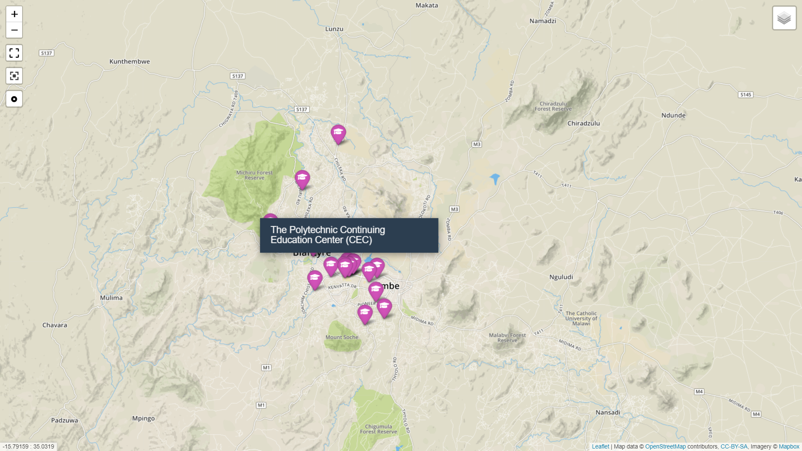
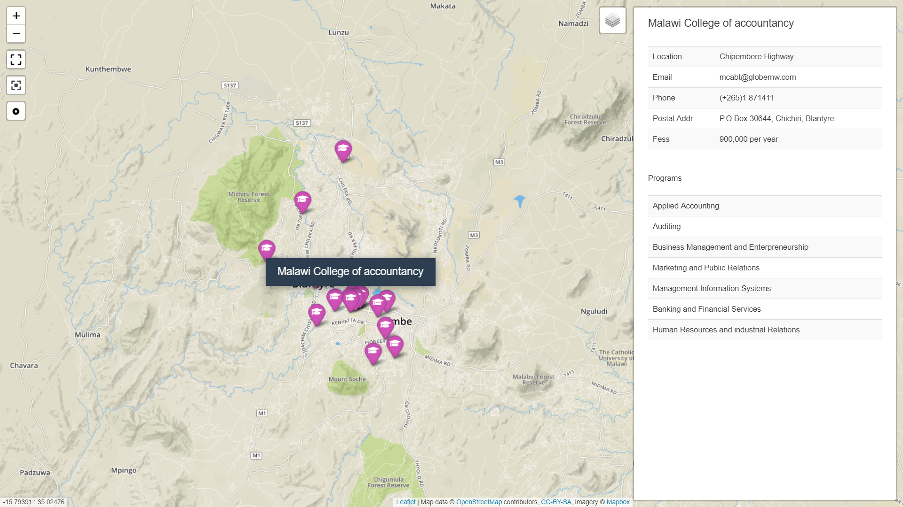
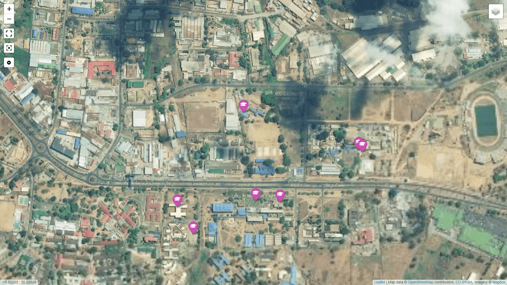
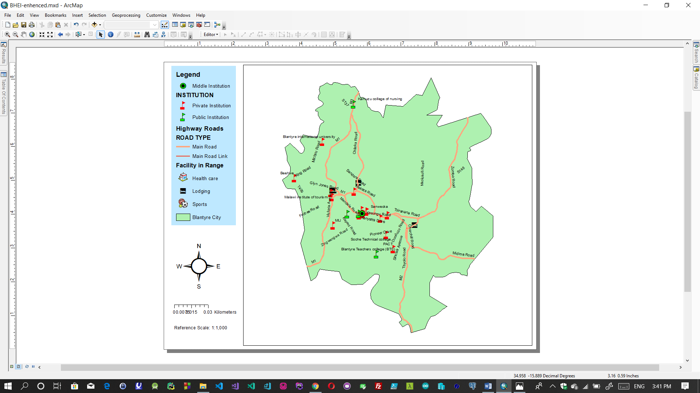
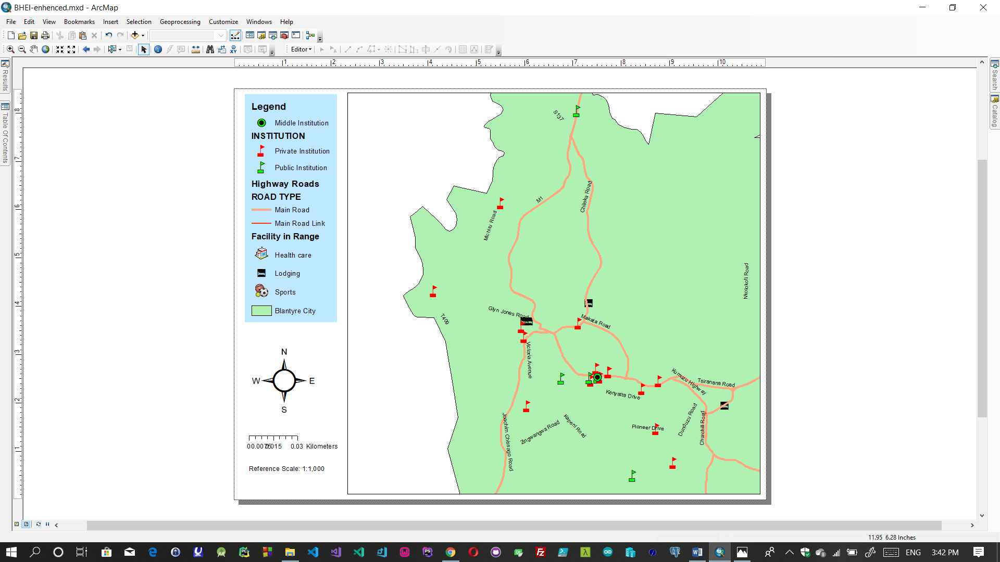

# bhei-gis
A GIS Web deployment for Blantyre Higher Education and Training Institutions data. 
It showcases available institutions in Blantyre together with their details.

# Introduction
Geographic information systems (GIS) are computer based systems which store, manipulate, analyses spatially linked data and displays 
summary information on a map.  Such systems are composed of people, data, procedures and technology to support communication 
and decision making.

In Malawi, it is the current norm for students to pursue and attain an academic qualification higher than the regular 
Malawi School Certificate of education (MSCE). Students and parents look for information on available colleges together with relevant
information on what they are offering that is: courses and approximate fees and possibly academic calendars.
Unfortunately, such information is not readily available and acquisition of such information is expensive. 
Potential students together with their parents incur costs to travel around to acquire this information. 
This is more expensive since these students want to compare available options hence they have to make travelling’s to several institutions
across the city.  Furthermore, acquisition of information puts an extra overhead on time which would have been used for other 
productive work.

## Samples

## Playing around | Installation 

###clone this repo  
`` git clone https://github.com/Fraganya/bhei-gis ``

### Adding Data
 you can add extra data to the excel file in ``documentation`` and import it in QGIS as a database table.   
 Finally export the database table to well formated GeoJson and point to the file in your ``index.html`` page.
 
### Mapbox key
  The web app requires a [mapbox](https://www.mapbox.com/) key , so you also need to sign up with [mapbox](https://www.mapbox.com/) and
  get a key to load [OSM](https://www.openstreetmap.org/) layers.
  
### Accessing the web map
  The map must be accessed by an HTTP prototocol that is you cannot access the index.html file directly as the AJAX loading of the data will not work.
  
### PS
Initially this was a class group assignment for BSC MIS 4 students :
  * Francis Ganya
  * Abigail Mwale
  * Angella Kamera
  * Before Ndakwera
  
  
  
 
 
